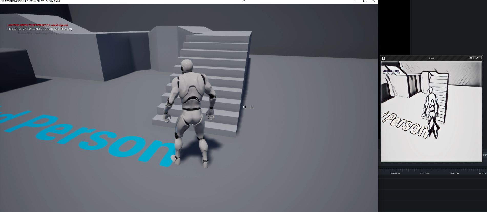

# StyleTransfer_UE4
realtime style transfer in unreal engine

## Steps for Release build 

* Right click `StyleTransfer.uproject`, click `generate visual studio project file`, then `StyleTransfer.sln` is appeared
* Open `StyleTransfer.sln`, select `Development Editor` to build
* Open `StyleTransfer.uproject`, go to menu `File-> Project Launcher -> Windows(64-bit)`
* Choose `folder\for\Release project`, waiting for the compiling result
* Go to `folder\for\Release project`, run `StyleTransfer.exe -WINDOWED -ResX=1920 -ResY=1080 -ExecCmds="r.OVST.Width 512, r.OVST.Height 512"`

* Press `~` to change the output size, for example, `r.OVST.Width 256` or `r.OVST.Height 256`